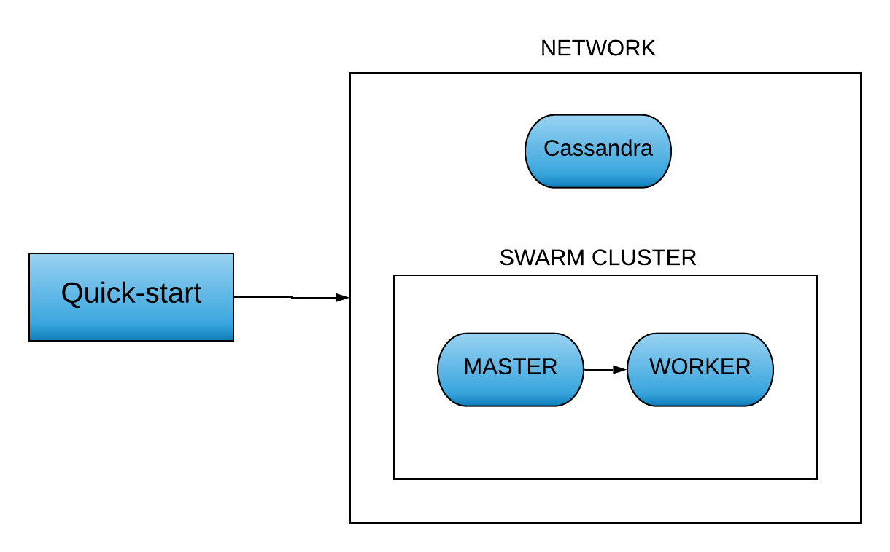

## Create virtual machines and setup swarm cluster
First we need to install docker. To do so go to https://docs.docker.com/v17.12/install/#supported-platforms and follow the instructions for your OS.

After installing docker, go to https://docs.docker.com/install/linux/linux-postinstall/ and follow the steps in **Manage Docker as a non-root user**.

Second we need to install docker-machine:
```bash
$ base=https://github.com/docker/machine/releases/download/v0.16.0 &&
  curl -L $base/docker-machine-$(uname -s)-$(uname -m) >/tmp/docker-machine &&
  sudo install /tmp/docker-machine /usr/local/bin/docker-machine
```
To install virtualbox go to https://www.virtualbox.org/wiki/Linux_Downloads and follow the instructions.

Then we create the virtual machines:
```bash
$ docker-machine create --driver virtualbox myvm1
$ docker-machine create --driver virtualbox myvm2
$ docker-machine ls
NAME    ACTIVE   DRIVER       STATE     URL                         SWARM   DOCKER     ERRORS
myvm1   -        virtualbox   Running   tcp://192.168.99.100:2376           v18.09.6   
myvm2   -        virtualbox   Running   tcp://192.168.99.101:2376           v18.09.6   
```
Let's initialize the swarm **(the parameter --advertise-addr has to be the ip of a vm in the previous list)**:
```bash
$ docker-machine ssh myvm1 "docker swarm init --advertise-addr 192.168.99.100"
Swarm initialized: current node (h2oqpc6zdrgas4qhoael9ld8v) is now a manager.
To add a worker to this swarm, run the following command:

    docker swarm join --token SWMTKN-1-4q2biqvtm04f29slk6s6yt154aov1e9z98gu7jol24xte8eeqj-6qcoshxgy2stl7wihhyq81vm8 192.168.99.100:2377
    
To add a manager to this swarm, run 'docker swarm join-token manager' and follow the instructions.
```
Now we will add one worker to this swarm, with the following command **(note that you have to use the previously given token, not the one in this example)**:
```bash
$ docker-machine ssh myvm2 "docker swarm join --token SWMTKN-1-4q2biqvtm04f29slk6s6yt154aov1e9z98gu7jol24xte8eeqj-6qcoshxgy2stl7wihhyq81vm8 192.168.99.100:2377"
```
List nodes in the swarm:
```bash
$ docker-machine ssh myvm1 "docker node ls"

ID                            HOSTNAME            STATUS              AVAILABILITY        MANAGER STATUS      ENGINE VERSION
h2oqpc6zdrgas4qhoael9ld8v *   myvm1               Ready               Active              Leader              18.09.6
17nyq6xzi8v7m114i7pkw5our     myvm2               Ready               Active                                  18.09.6

$ docker-machine ls
NAME    ACTIVE   DRIVER       STATE     URL                         SWARM   DOCKER     ERRORS
myvm1   *        virtualbox   Running   tcp://192.168.99.100:2376           v18.09.6   
myvm2   -        virtualbox   Running   tcp://192.168.99.101:2376           v18.09.6
```
Set docker machine shell environment **(this must always be done before executing runcompss-docker in a new terminal)**:
```bash
$ eval $(docker-machine env myvm1)
```
## Setup Cassandra container
Pull Cassandra container image:
```bash
$ docker pull cassandra
```
Create network to allow communication between containers:
```
$ docker network create --attachable -d overlay cass-net
```
Run Cassandra container attached to the network:
```bash
$ docker run --network=cass-net --memory 4g --name my-cass -d cassandra
```
The following image describes the infrastructure of the cluster:

## App execution
First, we need to add data to the Cassandra database. We will use datasets/words.csv.

Copy csv to Cassandra container:
```bash
$ docker cp datasets/words.csv my-cass:/
```
Create Cassandra keyspace and table:
```bash
$ docker exec my-cass cqlsh -e "CREATE KEYSPACE IF NOT EXISTS my_app WITH replication = {'class': 'SimpleStrategy', 'replication_factor': 1};"
$ docker exec my-cass cqlsh -e "CREATE TABLE IF NOT EXISTS my_app.words (position int PRIMARY KEY, words text);"
```
Add data to the table:
```bash
$ docker exec my-cass cqlsh -e "COPY my_app.words (position, words) FROM '/words.csv' WITH HEADER = TRUE;"
```
To simplify, you can also put these 3 instructions inside a .cql file:
```bash
$ docker cp datasets/words.csv my-cass:/
$ docker cp datasets/insert_words.cql my-cass:/
$ docker exec my-cass cqlsh -f /insert_words.cql
```
Execute the WordCount app with Hecuba and PyCOMPSs:
```bash
$ scripts/user/runcompss-docker --w=1 --s='192.168.99.100:2376' --i='bscdatadriven/hecuba-compss-quickstart:latest' --stack=teststack --context-dir='/root/code' --classpath=/root/conf/*.jar  --storage_conf=/root/conf/multinode.txt /root/code/WordCountExample.py
```
runcompss-docker allows to choose the parameters of the app deployment. Usage:
```bash
scripts/user/runcompss-docker
            --worker-containers=N
            --swarm-manager='<ip>:<port>'
            --image-name="DOCKERHUB_USER/IMG-NAME"
            --stack=stack-name
                        # [rest of classic runcompss args]
Example:
scripts/user/runcompss-docker
            --worker-containers=5
            --image-name='bscdatadriven/hecuba-compss-quickstart:latest'
            --stack=teststack
            --context-dir='/root/code'
            --swarm-manager='192.168.99.100:2376'
            --classpath=--classpath=/root/conf/*.jar # Here begin classic runcompss arguments...
            --storage_conf=/root/conf/multinode.txt
            -d
            /root/code/WordCountExample.py
            
# MANDATORY ARGUMENTS:
    --w, --worker-containers:  # Specify the number of worker containers the app will execute on.
                               # One more container will be created to host the master.
                               # Example: --worker-containers=2
    --i, --image-name:         # Specify the image name of the application image in Dockerhub. Remember you must generate this with runcompss-docker-gen-image.
                               # Remember as well that the format must be: "DOCKERHUB_USERNAME/APP_IMAGE_NAME:TAG" (the :TAG is optional).
                               # Example: --image-name='john123/my-compss-application:1.9'
    --s, --swarm-manager:      # Specify the swarm manager ip and port (format:  <ip>:<port>).
                               # Example: --swarm-manager='129.114.108.8:4000'
    --c, --context-dir:        # Specify the absolute application context directory inside the image.
                               # When using an application image, its provider must give you this information.
                               # Example: --swarm-manager='129.114.108.8:4000'
# OPTIONAL ARGUMENTS:
    --stack:                   # Specify the name of the stack that will be deployed.
                               # Example: --stack=teststack
    --c-cpu-units:             # Specify the number of cpu units used by each container (default value is 4).
                               # Example: --c-cpu-units=16
    --c-memory:                # Specify the physical memory used by each container in GB (default value is 8 GB).
                               # Example: --c-memory=32  # (each container will use 32 GB)
    --vm-creation-time:        # Time required to create a docker container on cloud (default: 60 sec)
                               # Example: --vm-creation-time=12
    --min-vms:                 # Minimum number of docker containers to run on cloud
    --max-vms:                 # Maximum number of docker containers to run on cloud
```
To finish, we can stop the Cassandra container with:
```bash
$ docker stop my-cass
```
## Already created swarm and Cassandra containers
If a swarm is already created, you can start the virtual machines without creating them:
```bash
$ docker-machine start myvm1
$ docker-machine start myvm2
$ eval $(docker-machine env myvm1)
```
Then we start the Cassandra container:
```bash
$ docker start my-cass
```
Now we can execute the app **(using --s='\<ip-swarm-manager>:2376')**:
```bash
$ scripts/user/runcompss-docker --w=1 --s='192.168.99.100:2376' --i='bscdatadriven/hecuba-compss-quickstart:latest' --stack=teststack --context-dir='/root/code' --classpath=/root/conf/*.jar  --storage_conf=/root/conf/multinode.txt /root/code/WordCountExample.py
```
## Execute your own app
To execute an application that you yourself have implemented, first you have to copy the code to the image. There are several ways to do this, for example using a Dockerfile.
There is already a Dockerfile in the quick-start, so you only have to copy your code files into the quick-start folder and run **(inside quick-start directory)**:
```bash
docker build . -t new-image-name
```
This will create another image with the name "new-image-name".
To finish, we can execute the app as follows **(using --i=new-image-name')**:
```bash
$ scripts/user/runcompss-docker --w=1 --s='192.168.99.100:2376' --i='new-image-name' --stack=teststack --context-dir='/code/' --classpath=/root/conf/*.jar  --storage_conf=/root/conf/multinode.txt /code/myfile.py
```
Be free to modify this Dockerfile to create your own image from the provided.
